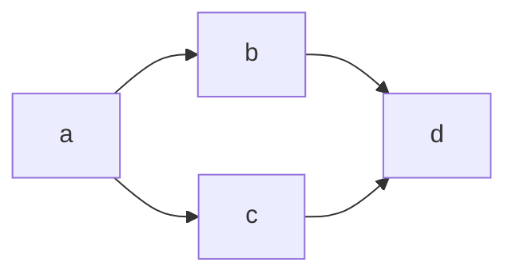
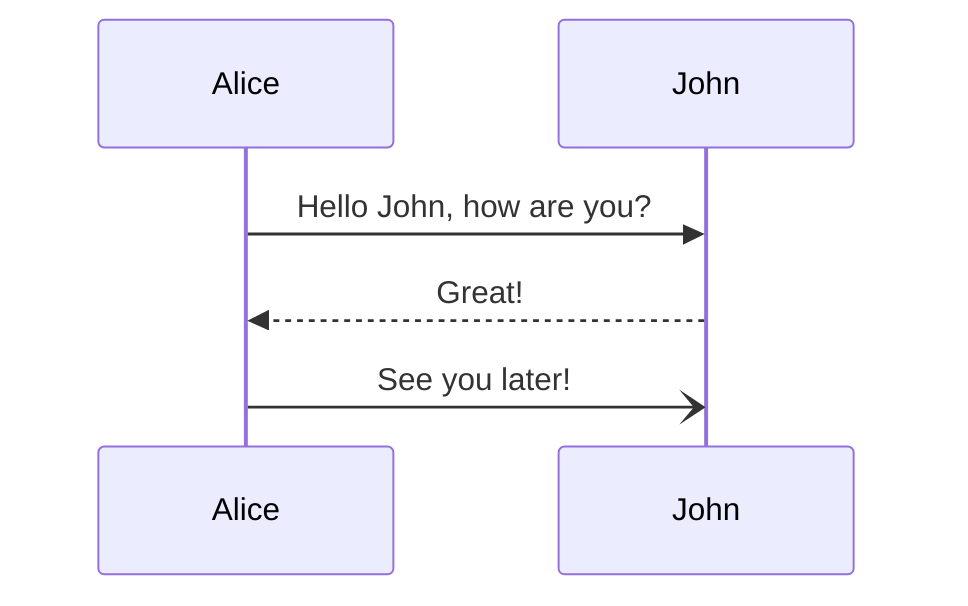
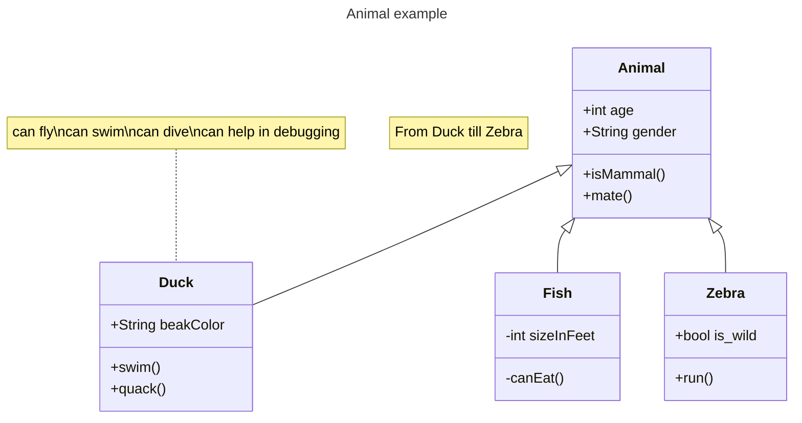
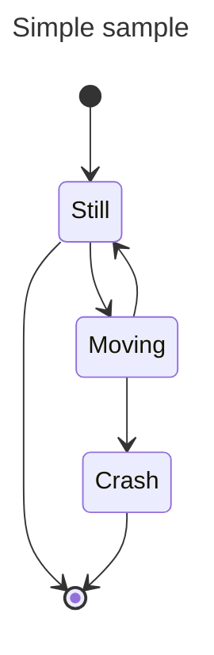

+++
title = 'Graph (Mermaid.js)'
+++

You can draw graph using [mermaid.js](https://mermaid.js.org/intro/getting-started.html) simply use code blocks with **mermaid** language.

### Flowchart

### Sequence diagrams

### Class diagrams

### State diagrams

